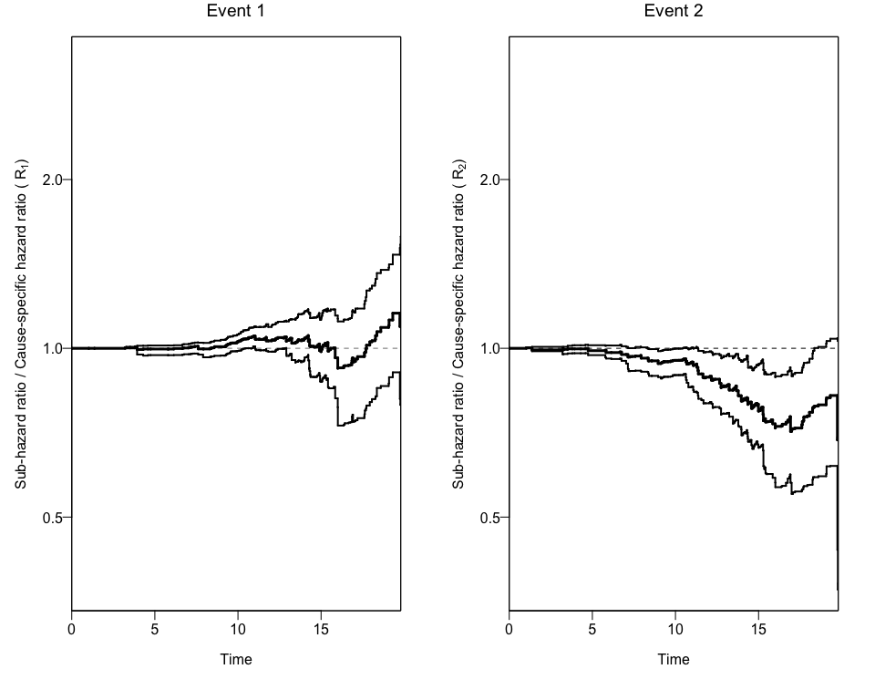

<!-- README.md is generated from README.Rmd. Please edit that file -->

# hrcomprisk

<!-- badges: start -->

<!-- badges: end -->

The goal of hrcomprisk is to estimate Nonparametric Cumulative-Incidence
Based Estimation of the Ratios of Sub-Hazard Ratios to Cause-Specific
Hazard Ratios

## Installation

You can install the version 0.1.0 of `hrcomprisk` from
[Github](https://github.com) with:

``` r
library(devtools)
install_github("AntiportaD/hrcomprisk")
```

## Using a formatted data set to apply the `hrcomprsk` package

You can use the dataset provided by the authors from the [CKiD
study](https://statepi.jhsph.edu/ckid/), wich has the necessary
variables to run the package.

``` r
library(hrcomprisk)
data <- hrcomprisk::dat_ckid
dim(data) #dimensions
#> [1] 626  13
names(data) #varible names
#>  [1] "b1nb0"        "event"        "male1fe0"     "incomelt30"  
#>  [5] "incomegt75"   "lps"          "foodassist"   "public"      
#>  [9] "matedultcoll" "privatemd"    "entry"        "exit"        
#> [13] "inckd"
```

The package will create a `data.frame` object with the cumulative
incidence of each competing risk for each exposure group. We can use the
`CRCumInc`
fuction.

``` r
mydat.CIF<-CRCumInc(df=data, time=exit, event=event, exposed=b1nb0, print.attr=T)
#> $names
#> [1] "event"       "exposure"    "time"        "CIoinc_comp" "CIxinc_comp"
#> [6] "CIoinc_1"    "CIxinc_1"    "CIoinc_2"    "CIxinc_2"   
#> 
#> $class
#> [1] "data.frame"
#> 
#> $row.names
#>   [1]   1   2   3   4   5   6   7   8   9  10  11  12  13  14  15  16  17
#>  [18]  18  19  20  21  22  23  24  25  26  27  28  29  30  31  32  33  34
#>  [35]  35  36  37  38  39  40  41  42  43  44  45  46  47  48  49  50  51
#>  [52]  52  53  54  55  56  57  58  59  60  61  62  63  64  65  66  67  68
#>  [69]  69  70  71  72  73  74  75  76  77  78  79  80  81  82  83  84  85
#>  [86]  86  87  88  89  90  91  92  93  94  95  96  97  98  99 100 101 102
#> [103] 103 104 105 106 107 108 109 110 111 112 113 114 115 116 117 118 119
#> [120] 120 121 122 123 124 125 126 127 128 129 130 131 132 133 134 135 136
#> [137] 137 138 139 140 141 142 143 144 145 146 147 148 149 150 151 152 153
#> [154] 154 155 156 157 158 159 160 161 162 163 164 165 166 167 168 169 170
#> [171] 171 172 173 174 175 176 177 178 179 180 181 182 183 184 185 186 187
```

## Using a the output to create Plots of CIFs and the Ratio of Hazard Ratios (Rk)

We can also obtain two different plots using the `plotCIF` function:

1.  The Cumulative Incidence of the both events of interest overall and
    by exposure level, and
2.  The ratios of Hazard rations (sub-distribution Hazard Ratio and
    cause-specific Hazard Ratio) by
event.

<!-- end list -->

``` r
plotCIF(cifobj=mydat.CIF, maxtime = 20, eoi = 1)
```


\#\# Bootstrapping the data to get 95% Confidence Intervals for the
Ratio of Hazard Ratios (Rk)

In order to get confidence intervals to the ratio of Hazard Ratios (Rk),
we can use the `bootCRCumInc`
function:

``` r
ciCIF<-bootCRCumInc(df=data, exit=exit, event=event, exposure=b1nb0, rep=100, print.attr=T)
#> $names
#> [1] "R1.lower" "R1.upper" "R2.lower" "R2.upper"
#> 
#> $class
#> [1] "data.frame"
#> 
#> $row.names
#>   [1]   1   2   3   4   5   6   7   8   9  10  11  12  13  14  15  16  17
#>  [18]  18  19  20  21  22  23  24  25  26  27  28  29  30  31  32  33  34
#>  [35]  35  36  37  38  39  40  41  42  43  44  45  46  47  48  49  50  51
#>  [52]  52  53  54  55  56  57  58  59  60  61  62  63  64  65  66  67  68
#>  [69]  69  70  71  72  73  74  75  76  77  78  79  80  81  82  83  84  85
#>  [86]  86  87  88  89  90  91  92  93  94  95  96  97  98  99 100 101 102
#> [103] 103 104 105 106 107 108 109 110 111 112 113 114 115 116 117 118 119
#> [120] 120 121 122 123 124 125 126 127 128 129 130 131 132 133 134 135 136
#> [137] 137 138 139 140 141 142 143 144 145 146 147 148 149 150 151 152 153
#> [154] 154 155 156 157 158 159 160 161 162 163 164 165 166 167 168 169 170
#> [171] 171 172 173 174 175 176 177 178 179 180 181 182 183 184 185 186 187
```

Finally, we can use this new data to add the 95% Confidence Intervals to
the previous plot using again the `plotCIF`
function.

``` r
plotCIF(cifobj=mydat.CIF, maxtime= 20, ci=ciCIF, eoi=1)
```


\#\# The wrapper function `npcrest`

The package also offers a wrapper function (`npcrest`) to do all this
analyses in one
step.

``` r
npcrest(df=data, exit=exit, event=event, exposure=b1nb0,  rep=100, eoi=1)
#> $names
#> [1] "event"       "exposure"    "time"        "CIoinc_comp" "CIxinc_comp"
#> [6] "CIoinc_1"    "CIxinc_1"    "CIoinc_2"    "CIxinc_2"   
#> 
#> $class
#> [1] "data.frame"
#> 
#> $row.names
#>   [1]   1   2   3   4   5   6   7   8   9  10  11  12  13  14  15  16  17
#>  [18]  18  19  20  21  22  23  24  25  26  27  28  29  30  31  32  33  34
#>  [35]  35  36  37  38  39  40  41  42  43  44  45  46  47  48  49  50  51
#>  [52]  52  53  54  55  56  57  58  59  60  61  62  63  64  65  66  67  68
#>  [69]  69  70  71  72  73  74  75  76  77  78  79  80  81  82  83  84  85
#>  [86]  86  87  88  89  90  91  92  93  94  95  96  97  98  99 100 101 102
#> [103] 103 104 105 106 107 108 109 110 111 112 113 114 115 116 117 118 119
#> [120] 120 121 122 123 124 125 126 127 128 129 130 131 132 133 134 135 136
#> [137] 137 138 139 140 141 142 143 144 145 146 147 148 149 150 151 152 153
#> [154] 154 155 156 157 158 159 160 161 162 163 164 165 166 167 168 169 170
#> [171] 171 172 173 174 175 176 177 178 179 180 181 182 183 184 185 186 187
#> 
#> $names
#> [1] "R1.lower" "R1.upper" "R2.lower" "R2.upper"
#> 
#> $class
#> [1] "data.frame"
#> 
#> $row.names
#>   [1]   1   2   3   4   5   6   7   8   9  10  11  12  13  14  15  16  17
#>  [18]  18  19  20  21  22  23  24  25  26  27  28  29  30  31  32  33  34
#>  [35]  35  36  37  38  39  40  41  42  43  44  45  46  47  48  49  50  51
#>  [52]  52  53  54  55  56  57  58  59  60  61  62  63  64  65  66  67  68
#>  [69]  69  70  71  72  73  74  75  76  77  78  79  80  81  82  83  84  85
#>  [86]  86  87  88  89  90  91  92  93  94  95  96  97  98  99 100 101 102
#> [103] 103 104 105 106 107 108 109 110 111 112 113 114 115 116 117 118 119
#> [120] 120 121 122 123 124 125 126 127 128 129 130 131 132 133 134 135 136
#> [137] 137 138 139 140 141 142 143 144 145 146 147 148 149 150 151 152 153
#> [154] 154 155 156 157 158 159 160 161 162 163 164 165 166 167 168 169 170
#> [171] 171 172 173 174 175 176 177 178 179 180 181 182 183 184 185 186 187
```


